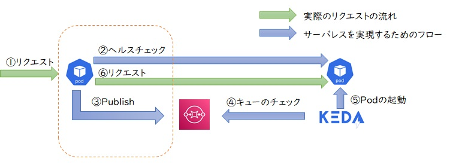

# nautible-kong-serverless

KEDAと組み合わせることで、HTTPリクエストベースのサービスをサーバレス化するプラグイン。

Podを利用しないときはPod数0とし、HTTPリクエストをトリガーにPodを起動するためのプラグイン。KEDAと組み合わせて利用する。また、プラグインからキューへのアクセスについてはDaprを用いている。そのため、利用可能なキューとしてはDaprおよびKEDAがサポートしているものとなる。

## 概要

KEDAはイベント駆動型のアプリケーションにPod数0～Nのオートスケール機能を付与するプロダクト。リクエストがキューに溜まっている間にアプリケーションを起動し、アプリケーションがキューにリクエストを取りに行くモデルとなる。

KEDAを単独で使用する場合の制約としては、下図のようにキューの保留場所がなく直接リクエストを送信されるような仕組みではPod数を0にすることができないためHTTPリクエストを受信するアプリケーションでは利用できない。


そのため、同期通信に対応しようと考えた場合、下図のようにアプリケーションの手前でリクエストをいったん保留し、KEDAがアプリケーションを起動した後にリクエストを流す仕組みが必要となる。



このリクエストをいったん保留する場所としてAPIGatewayの[Kong Gateway](https://konghq.com/products/api-gateway-platform)を利用する。

Kong GatewayはOSSで開発されている代表的なAPIゲートウェイの1つで、プラグイン機構によりリクエストを受け取った際やレスポンスを返す際など、いくつかのタイミングで処理をフックして独自機能を追加することが可能となっている。そのためリクエストを後続に流す前にヘルスチェックやキューへのデータ登録などの処理を実装する。

全体のアーキテクチャは下記のようになる。


## 構成

- APIGateway
  - Kong 2.8
- Queue
  - RabbitMQ（Minikube）
  - SQS(AWS)
  - ServiceBus(Azure ※今後対応予定)
  - Pub/Sub(GoogleCloud ※今後対応予定)
- Pod AutoScaler
  - KEDA

## フォルダ構成

```text
$HOME
├ keda
│  ├ INSTALL.md ・・・ KEDAインストール説明ドキュメント
│  ├ scaledobject_aws.yaml ・・・ AWS用ScaledObjectデプロイ用マニフェストファイル
│  └ scaledobject_local.yaml ・・・ ローカル用ScaledObjectデプロイ用マニフェストファイル（RabbitMQ接続）
├ kong
│  ├ INSTALL.md ・・・ Kong Gatewayインストール説明ドキュメント
│  └ values.yaml ・・・ HELM設定ファイル
├ plugin
│  ├ cmd ・・・ プラグインのエントリーポイント
│  ├ manifests ・・・ サンプルマニフェストファイル
│  ├ package ・・・ Dockerfile
│  ├ pkg ・・・ カスタマイズ処理の本体
│  ├ go.mod ・・・ 導入モジュール
│  └ go.sum・・・ 依存モジュールのパスやバージョン
├ rabbitmq
│  └ INSTALL.md ・・・ RabbitMQインストール説明ドキュメント
├ sample
│  ├ configmap.yaml ・・・ マウントするHTMLファイルを定義したConfigmap
│  ├ deployment.yaml ・・・ サンプルアプリケーション（Nginx）のDeployment
│  ├ service.yaml ・・・ サンプルアプリケーションのService
│  └ README.md ・・・ サンプルアプリケーションの説明
├ LICENSE
└ README.md
```

## リポジトリ作成

ECRパブリックリポジトリにプラグイン用のリポジトリを作成する。（Terraformによる作成を推奨）

```text
nautible-kong-serverless
```

## KEDAの導入

[keda/INSTALL.md](./keda/INSTALL.md)を参照


## Kongの導入

[kong/INSTALL.md](./kong/INSTALL.md)を参照

## プラグイン作成

[plugin/README.md](./plugin/README.md)を参照

## ローカル（Minikube）での実行

### サンプルアプリケーションデプロイ

```bash
kubectl apply -f sample/.
```

### KEDAのScaledObjectを導入

scaledobject_local.yamlのhostにRabbitMQの接続情報を記載しているので、パスワード部分のみ現在のRabbitMQのパスワードに変更して下記を実行する。

```bash
kubectl apply -f keda/scaledobject_local.yaml
```

### Kong Plugin設定を導入

plugin/manifests/pubsub.yamlにRabbitMQの接続情報を記載しているので、パスワード部分のみ現在のRabbitMQのパスワードに変更して下記を実行する。

```bash
kubectl apply -f plugin/manifests/.
```

### ExternalIPの設定

下記コマンド実行（sudoパスワードを聞かれた際は入力する）

```bash
minikube tunnel
```

### ブラウザからアクセス

```bash
http://localhost/kong/
```

## プラグインの実装変更時手順

Kongプラグインの実装を更新した際はKong Gatewayのコンテナを再作成し、最新のコンテナを再デプロイする。

### デプロイしているコンテナを更新

kong/values.yamlのイメージタグを更新

```yaml
image:
  repository: 'public.ecr.aws/nautible/nautible-kong-serverless'
  tag: 'v0.1.1' # 再作成した際に付与したタグを記載
```

再デプロイ

```bash
helm upgrade serverless-kong kong/kong -n kong --values ./kong/values.yaml
```
